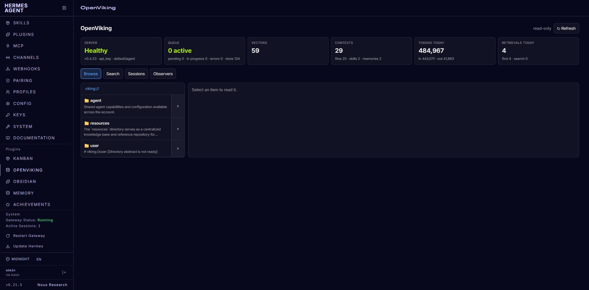

# OpenViking Browser for Hermes

A read-only [OpenViking](https://github.com/volcengine/OpenViking) browser for the
[Hermes Agent](https://github.com/NousResearch/hermes-agent) dashboard. It adds an **OpenViking** tab where you can
look at server status, walk the `viking://` tree, read abstracts / overviews / content, and search, without leaving
the dashboard.

> Not affiliated with Nous Research or the OpenViking project.

## Screenshot



## Features

- **Status cards**: health, version, auth mode, queue (pending / in progress / errors), vector count, context counts,
  today's tokens.
- **Tree browser**: lazy `viking://` navigation with breadcrumbs and per-node abstracts.
- **Reader**: Abstract / Overview / Content (paged by lines). Always rendered as plain text, never as HTML.
- **Search**: semantic `find`, text `grep` and path `glob`, scoped to the current directory.
- **Sessions** list and raw **observer** reports (queue, system, vikingdb, models, retrieval, filesystem, lock).
- No external assets or CDN. The layout adapts to small screens.

## Requirements

- Hermes Agent with dashboard plugin support (`~/.hermes/plugins/<name>/dashboard/manifest.json`).
- A reachable OpenViking server and an API key for it (see [Security model](#security-model)).
- Nothing else to install: the backend uses `fastapi`, `httpx` and `pydantic`, which ship with Hermes.

## Install

```bash
git clone https://github.com/galiehneh/hermes-openviking-browser ~/.hermes/plugins/openviking-browser
hermes plugins enable openviking-browser
```

Configure the server (add to `~/.hermes/.env`, see [Configuration](#configuration)):

```bash
OPENVIKING_URL=http://127.0.0.1:1933
OPENVIKING_API_KEY=<your OpenViking user key>
```

Then **restart the dashboard**. Backend routes are mounted once at startup, so the tab cannot work until the
dashboard has been restarted. A "rescan" only refreshes the tab list.

The repository root is the plugin directory (`plugin.yaml` and `dashboard/` live at the top level), so a plain
`git clone` into `~/.hermes/plugins/` is a complete install. `git pull` plus a dashboard restart updates it.

## Configuration

| Variable | Default | Purpose |
|---|---|---|
| `OPENVIKING_URL` | `http://127.0.0.1:1933` | Base URL of the OpenViking server. |
| `OPENVIKING_API_KEY` | unset | The API key, used directly. Highest priority. |
| `OPENVIKING_CREDENTIALS_FILE` | unset | Path to a JSON file with an `agent_user_key` field. |
| *(fallback file)* | `~/.openviking/credentials.json` | Used when neither variable above yields a key. |

Key resolution order:

1. `OPENVIKING_API_KEY`
2. `agent_user_key` in the JSON file named by `OPENVIKING_CREDENTIALS_FILE`
3. `agent_user_key` in `~/.openviking/credentials.json`
4. Otherwise the API answers `503 NO_CREDENTIALS` with a message saying what to set.

Credentials file format (only `agent_user_key` is read; other fields are ignored):

```json
{ "agent_user_key": "<your OpenViking user key>" }
```

The file is re-read when it changes, so rotating the key needs no restart. Changing environment variables does.

## Security model

- **Read-only whitelist.** `dashboard/api.py` has no generic proxy. Every route maps to a hard-coded
  `(method, upstream path)` pair in `_UPSTREAM`: `GET` reads, plus the `find` / `grep` / `glob` search `POST`s.
  Write, delete, admin, `mv`, `cp`, `mkdir`, reindex, resource import and session-mutation endpoints are not
  reachable, and `_call()` re-checks the whitelist before every upstream request.
- **URI validation.** Every `uri` must be a plain `viking://` path: length-limited, no `?` / `#`, no control
  characters or backslashes, and no `.` / `..` segments, also after (repeated) percent-decoding.
- **Strict inputs.** Request bodies reject unknown fields and cap limits and pattern lengths. Reads are paged and
  never "read to end".
- **The key stays on the server.** It is sent to OpenViking as `X-API-Key` and nowhere else. It is never returned
  to the browser, never logged, and scrubbed from any upstream text. Upstream errors are reduced to a truncated
  error code and message. Redirects are not followed, so the key cannot be forwarded to another host.
- **Which key to use.** Give the plugin a **user-level** key (the one OpenViking issues for an agent user), not an
  admin / root key. A credentials file is only read for `agent_user_key`; a `root_api_key` field in the same file
  is never read. `OPENVIKING_API_KEY` is taken as-is, so the choice of a least-privilege key is yours.
- **Authentication to the plugin** is Hermes' dashboard session auth, which protects every `/api/*` route. The
  plugin adds no auth of its own.
- **Upstream 401/403 become 502.** Hermes' front end treats a 401 as an expired dashboard session and redirects
  to the login page, so a rejected OpenViking key is reported as `502` instead.

## API

All routes live under `/api/plugins/openviking-browser`.

| Method | Route | Upstream OpenViking call |
|---|---|---|
| GET | `/status` | `/health`, observer `queue`, `/api/v1/debug/vector/count`, `/api/v1/console/dashboard/summary` (aggregated; partial failures tolerated) |
| GET | `/health` | `/health` |
| GET | `/summary` | `/api/v1/console/dashboard/summary` |
| GET | `/sessions` | `/api/v1/sessions` |
| GET | `/observer/{name}` | `/api/v1/observer/{name}`, `name` is one of `queue system vikingdb models retrieval filesystem lock` |
| GET | `/ls?uri=` | `/api/v1/fs/ls` |
| GET | `/tree?uri=` | `/api/v1/fs/tree` |
| GET | `/stat?uri=` | `/api/v1/fs/stat` |
| GET | `/abstract?uri=` | `/api/v1/content/abstract` |
| GET | `/overview?uri=` | `/api/v1/content/overview` |
| GET | `/read?uri=&offset=&limit=` | `/api/v1/content/read` (limit ≤ 2000 lines) |
| POST | `/find` | `/api/v1/search/find` (`query`, `target_uri`, `limit`, `score_threshold`) |
| POST | `/grep` | `/api/v1/search/grep` (`uri`, `pattern`, `case_insensitive`, `node_limit`) |
| POST | `/glob` | `/api/v1/search/glob` (`pattern`, `uri`, `node_limit`) |

Error codes: `400 INVALID_URI`, `422` invalid parameters, `503 NO_CREDENTIALS`, `502 UPSTREAM_UNREACHABLE` /
`UPSTREAM_ERROR` / `UPSTREAM_BAD_RESPONSE`. Other upstream 4xx (for example 404) are passed through.

## Troubleshooting

| Symptom | Cause and fix |
|---|---|
| The OpenViking tab does not appear | The plugin is not in `plugins.enabled` (run `hermes plugins enable openviking-browser`), or the dashboard was not restarted afterwards. Also check that `plugin.yaml` is directly inside `~/.hermes/plugins/openviking-browser/`, not in a nested folder. |
| Tab appears but every request fails with 404 | Backend routes were not mounted. Restart the dashboard (a rescan is not enough). |
| Redirected to the login page | The Hermes dashboard session expired (401 from Hermes itself). Log in again. |
| `503 NO_CREDENTIALS` | No key found. Set `OPENVIKING_API_KEY`, or create the credentials file with `agent_user_key`, then restart the dashboard if you used an environment variable. |
| `502 UPSTREAM_UNREACHABLE` | The dashboard host cannot reach `OPENVIKING_URL` (wrong URL, server down, firewall). |
| `502` with an auth-related code | OpenViking rejected the key (401/403). Check that it is a valid user key for that server. |
| `502 UPSTREAM_ERROR` | OpenViking returned a 5xx. Check the server logs. |

## Uninstall

```bash
hermes plugins disable openviking-browser
rm -rf ~/.hermes/plugins/openviking-browser
```

Remove `OPENVIKING_*` entries from `~/.hermes/.env` if you added them, and restart the dashboard.

## Development

```bash
git clone https://github.com/galiehneh/hermes-openviking-browser
cd hermes-openviking-browser

pip install -r requirements-dev.txt   # fastapi, httpx, pydantic, pytest
python -m pytest tests -q             # API tests (mocked upstream, no network, no real credentials)

npm install                           # jsdom, react, react-dom (dev only)
npm test                              # renders dashboard/plugin.js against canned responses
```

The tests cover route-to-upstream mapping, rejection of non-whitelisted paths and write methods, URI validation,
limit caps, secret non-disclosure (responses, errors, logs) and key resolution. CI runs both suites on every push and
pull request. See [CONTRIBUTING.md](CONTRIBUTING.md).

## Limitations

- **Read-only by design.** You cannot add, edit, move or delete anything from this UI.
- Tested against **OpenViking v0.4.23**. Other versions may expose different endpoints or response shapes.
- Needs a Hermes build that supports dashboard plugins with a backend (`api`) router.
- One OpenViking server per Hermes install.

## Relation to `hermes-plugin-openviking`

[`NousResearch/hermes-plugin-openviking`](https://github.com/NousResearch/hermes-plugin-openviking) is the official
agent **memory provider**: it lets the Hermes agent store and recall memories in OpenViking. This project is a
**dashboard UI** for humans to look at what is stored. The two are complementary and independent; this project is not
affiliated with or endorsed by Nous Research.

## License

[MIT](LICENSE)
